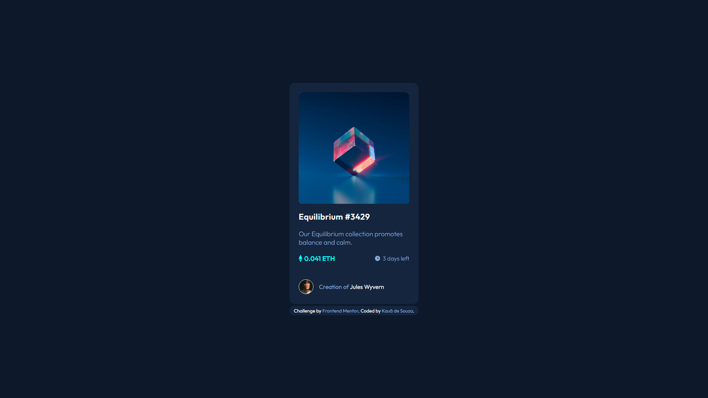
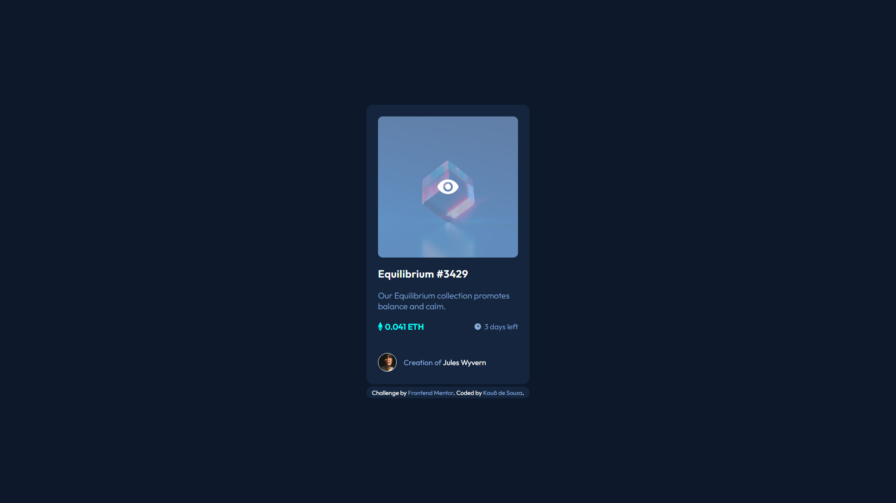
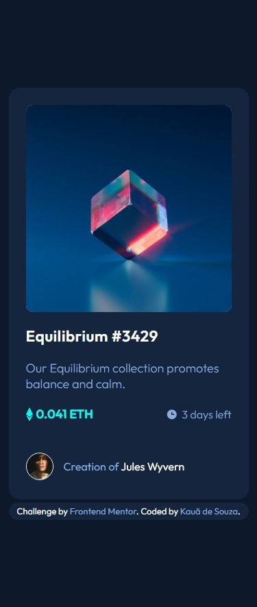

# Frontend Mentor - NFT preview card component solution

This is a solution to the [NFT preview card component challenge on Frontend Mentor](https://www.frontendmentor.io/challenges/nft-preview-card-component-SbdUL_w0U). Frontend Mentor challenges help you improve your coding skills by building realistic projects. 

## Table of contents

- [Overview](#overview)
  - [Objectives](#objectives)
  - [Screenshot](#screenshot)
    - [Desktop Preview](#desktop-preview)
    - [Mobile Preview](#desktop-preview)
- [My process](#my-process)
  - [Built with](#built-with)
  - [Useful resources](#useful-resources)
- [Author](#author)

# Overview

## Objectives

Users should be able to:

- View the optimal layout depending on their device's screen size
- See hover states for interactive elements

## Screenshot

### **Desktop Preview**

### **Mobile Preview**

  

  
# My process

## Built with

- Semantic HTML5 markup
- CSS custom properties

## Useful resources

- [Image Faded Overlay](https://www.w3schools.com/howto/howto_css_image_overlay.asp) - This "How to" section about CSS from W3Schools helped me alot to resolve the property hover onto NFT card image.  

# Author

- Frontend Mentor - [@KauaSCSantos](https://www.frontendmentor.io/profile/KauaSCSantos)
- Github - [@KauaSCSantos](https://github.com/KauaSCSantos)
