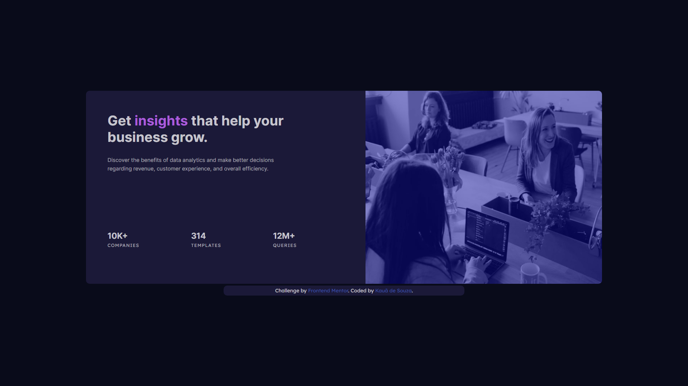

# Frontend Mentor - Stats preview card component solution

This is a solution to the [Stats preview card component challenge on Frontend Mentor](https://www.frontendmentor.io/challenges/stats-preview-card-component-8JqbgoU62). Frontend Mentor challenges help you improve your coding skills by building realistic projects. 

## Table of contents

- [Overview](#overview)
  - [Objective](#objective)
  - [Screenshot](#screenshot)
    - [Desktop Preview](#desktop-preview)
    - [Mobile Preview](#desktop-preview)
- [My process](#my-process)
  - [Built with](#built-with)
  - [Useful resources](#useful-resources)
- [Author](#author)

## Overview

### Objective

Users should be able to:

- View the optimal layout depending on their device's screen size

### Screenshot

### **Desktop Preview**

### **Mobile Preview**

  

## My process

### Built with

- Semantic HTML5 markup
- CSS custom properties
- Mobile-first workflow

### Useful resources

- [@media Rules CSS](https://www.w3schools.com/cssref/css3_pr_mediaquery.asp) - CSS @media Rules from W3Schools were useful about page's responsivity.

# Author

- Frontend Mentor - [@KauaSCSantos](https://www.frontendmentor.io/profile/KauaSCSantos)
- Github - [@KauaSCSantos](https://github.com/KauaSCSantos)
